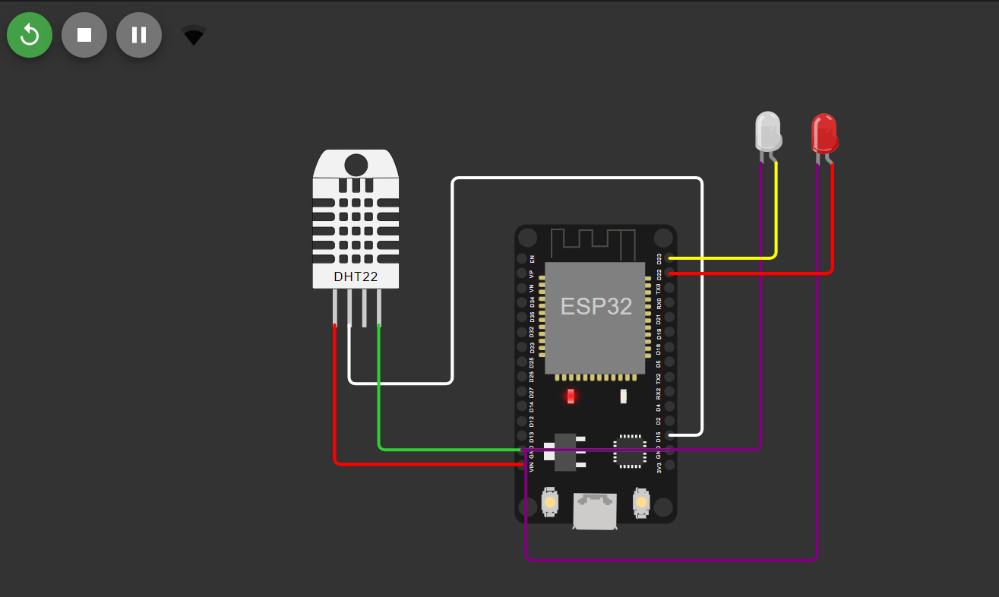
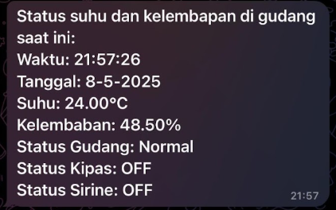
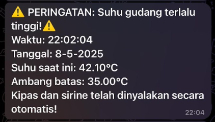

# IoT-Based Warehouse Temperature and Humidity Monitoring System

> 📦 **Note:** The main repository for this project is hosted at [this repository](https://github.com/tzucun/Pemantauan-Suhu-dan-Kelembapan-berbasis-IoT-ESP32-DHT22-dan-Bot-Telegram).

---

## 📌 Project Overview

This project implements a real-time temperature and humidity monitoring system for warehouse storage, using IoT technology. It is designed to help prevent damage to goods caused by poor environmental conditions.

---

## 🎯 Main Features

- **Real-Time Monitoring**  
  Monitors warehouse temperature and humidity levels using the **DHT22** sensor connected to an **ESP32** microcontroller.

- **Automated Actuators**  
  Automatically activates a **fan** and a **siren** (via relay) when:
  - Temperature reaches **≥ 35°C**
  - Humidity drops to **≤ 40%**  
  These actuators turn off automatically once conditions return to safe levels.

- **Early Warning System via Telegram**  
  Sends alerts to users through a **Telegram Bot** if temperature or humidity exceeds defined thresholds, indicating an unsafe condition in the warehouse.

- **User Interaction through Telegram**  
  Users can communicate with the Telegram Bot to:
  - Check current temperature and humidity
  - View the status of the warehouse conditions
  - Use commands such as `/cek_ambang` to query thresholds
- **Web Dashboard API Integration** Functions as a web server exposing API endpoints for a dedicated web dashboard. This includes:
  - **Data Fetching**: Endpoints to get real-time sensor data and actuator status.
  - **Remote Control**: An endpoint to send commands to the ESP32 from the dashboard.
  - **CORS Support**: Implemented to allow secure cross-origin communication with the web dashboard.

---

## 🧪 Simulation with Wokwi

This project is simulated using [Wokwi](https://wokwi.com/), with some adaptations:

- **Red LED** represents the **fan**
- **White LED** represents the **siren**

---

## 🛠️ Implementation Design

| Real Hardware Design | Wokwi Simulation Design |
|----------------------|-------------------------|
|  |  |

---

## 📸 Scenario Demonstrations

### ✅ Normal Conditions

| Wokwi Simulation | Telegram Bot |
|------------------|--------------|
|  |  |

---

### 🌡️ Temperature ≥ 35°C

| Wokwi Simulation | Telegram Bot |
|------------------|--------------|
|  |  |

---

### 💧 Humidity ≤ 40%

| Wokwi Simulation | Telegram Bot |
|------------------|--------------|
|  |  |

---

### 💬 Command `/cek_ambang`

 | Telegram Bot |
 |--------------|
 |  |

---

## 🤖 Interacting with the Telegram Bot
The Telegram bot allows you to remotely monitor warehouse conditions and trigger commands.
> Telegram Bot Link: [@pemantauanGudangBot](https://t.me/PemantauanGudangBot).

---
### 🌐 Web Dashboard Integration

This project is also designed to integrate with a dedicated web dashboard for real-time data visualization and control.

* **Dashboard Repository**: The full code for the web dashboard can be found here: **[https://github.com/ElloRabyndra/Warehouse-Dashboard](https://github.com/ElloRabyndra/Warehouse-Dashboard)**.
* **Wokwi API Endpoints**: This project exposes several API endpoints for the dashboard to consume, including:
    * `GET /api/ping` - To check the connection status.
    * `GET /api/status` - To get the current temperature, humidity, and actuator status data.
    * `POST /api/command` - To send control commands to the ESP32.
* **CORS Support**: Cross-Origin Resource Sharing (CORS) has been enabled to allow connections from a locally running web dashboard.

---

### ⚙️ How to Connect with the Web Dashboard (Wokwi)
To connect this project with the web dashboard in the Wokwi simulation environment, ensure you have configured the `wokwi.toml` file with port forwarding.

```toml
[wokwi]
version = 1
firmware = '.pio\build\featheresp32\firmware.bin'
elf = '.pio\build\featheresp32\firmware.elf'

[[net.forward]]
from = "localhost:8180"
to = "target:80"
